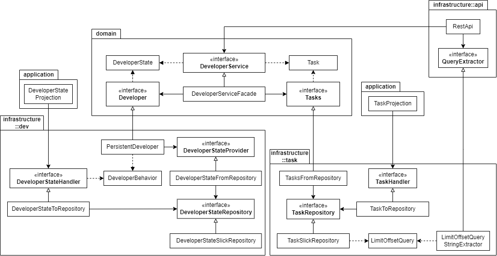

# Persistent Developer
Persistent Developer - пример небольшого полноценного приложения на Scala 
с использованием Event Sourcing, CQRS, TDD и принципов чистой архитектуры, 
написанный преимущественно чтобы здесь был репозиторий хотя бы с одним завершённым приложением.

## Функционал
Приложение представляет собой простой сервис выполнения задач разработчиком.

Разработчик принимает команды на выполнение задач. 
В зависимости от его текущего состояния он может 
немедленно взять задачу в разработку или поставить её в очередь. 
В любой момент можно узнать информацию о существующих задачах 
и текущем состоянии разработчика.

Время работы над задачами и отдыха после выполнения задачи 
определяется сложностью задачи и соответствующим настраивым коэффициентом (множителем).

### Состояния разработчика
У разработчика есть три состояния:
- Свободен - начальное состояние, в котором разработчику хорошо, 
  он отдохнувший и все задачи выполнены. 
  Он так и жаждет получить новую!
- Работает - разработчик в процессе выполнения задачи. 
  По завершении работы ему обязательно понадобится отдохнуть. 
  Новые задачи ставятся в очередь.
- Отдыхает - выполнив задачу, разработчик сильно устал, 
  поэтому ему требуется отдых - обязательно пропорциональный сложности задачи! 
  Новые задачи ставятся в очередь, и хоть разработчик не прочь освободиться, 
  по окончании отдыха он приступит к выполнению следующей задачи, если она имеется.

### Задачи
В реальной жизни все задачи прекрасны и уникальны, 
но в рамках сервиса Persistent Developer 
они примерно так же реальны, как и разработчик, их выполняющий. 
У задач, которые принимает разработчик, есть всего одно свойство: их сложность.

Сложность задач измеряется целым числом от 1 до 100. 
Попытаться вручить разработчику более сложную 
(или каким-то образом более лёгкую) задачу - немилое дело.

Как только разработчик узнал о том, что мы поручили ему задачу,
ей присваивается статус. Статусов задач три:
- В очереди
- В работе
- Завершена

Время выполнения задачи и отдыха после неё 
определяется сложностью задачи и множителями работы и отдыха соответственно 
(настраиваются в файле конфигурации). 
Например, для задачи со сложностью 17 и рабочим множителем 829 
время работы будет составлять 17 * 829 = 14093 мс.
Множители задаются целыми числами от 1 до 1000.

### Команды
Разработчику приходится многое терпеть в своей профессиональной жизни. 
Поэтому он строго ограничил то, что он готов терпеть от нас. 
Как бы нам ни хотелось пригласить его вместе послушать Yankee Hotel Foxtrot на виниле, 
всё, что он готов делать - это принимать от нас задачи.
Он предоставил нам доступ к команде, позволяющей поручить ему новую задачу.

### Запросы
У всех есть право на информацию. В частности - у нас!

В связи с этим мы имеем возможность узнать информацию о всех задачах, 
к которым когда-либо прикасался разработчик. 
Мы можем получить их список или актуальную информацию о конкретной задаче. 
Кроме того, у нас есть доступ к социальной сети, 
в которой разработчик регулярно обновляет свой статус. 
(Само собой, он об этом не знает!)
Так что мы можем ещё и узнать его текущее состояние.

## Структура
Приложение написано на Scala 2.13.10. Для большей части инфраструктурного кода используется стек Akka:
- разработчик реализован в виде персистентного актора на основе Akka Persistence;
- таблицы для запросов заполняются с помощью проекций на Akka Projection;
- REST API реализовано на Akka HTTP (с использованием Spray JSON).

В качестве базы данных используется PostgreSQL, а тесты написаны с использованием ScalaTest и ScalaMock.

Упрощённая схема архитектуры приложения:



# Запуск
## Без контейнера
Для запуска приложения требуется наличие базы данных PostgreSQL 
со схемой, созданной скриптами из папки [tools/postgres-initdb](tools/postgres-initdb). 
Указать параметры для подключения к базе данных можно 
в файле конфигурации [src/main/resources/application.conf](src/main/resources/application.conf).

Развернув базу данных и подтянув зависимости, 
можно скомпилировать и запустить приложение излюбленным способом, 
передав в качестве точки входа класс `rr64.developer.application.Main`:
```shell
sbt update
sbt compile
sbt runMain rr64.developer.application.Main
```

### Тесты
Для запуска тестов хранилища задач и состояний разработчика 
требуется доступ к базе данных PostgreSQL, 
прописанной в [src/test/resources/application.conf](src/test/resources/application.conf). 
Эта база данных используется для создания и удаления 
баз данных для каждого набора тестов. 
Единственное предусловие - отсутствие баз данных с названиями, аналогичными тестовым 
(для них используются названия наборов тестов - 
например, `DeveloperStateSlickRepositoryTestSuite`).

Для остальных тестов не требуется каких-либо предусловий, поэтому смело можно делать:
```shell
sbt test
```

## В контейнере
Контейнеризация приложения состоит из двух шагов - 
сборки uber jar и создания Docker-образа:
```shell
sbt assembly
docker build -t persistent-developer --build-arg version=0.1
```

В корне репозитория хранится конфигурация Docker Compose 
для запуска образа приложения совместно с базой данных PostgreSQL. 
Схема базы данных для приложения создаётся при первом запуске образа, 
а её данные сохраняются в томе Docker.

После сборки образа для запуска достаточно выполнить:

```shell
docker-compose up -d
```

Для остановки:

```shell
docker-compose down
```

# Как пользоваться
Приложение предоставляет REST API (по умолчанию на порте 10538). 
Краткое описание:
- `POST /api/command/add-task` - добавить задачу. 
  Сама задача передаётся в теле запроса в формате JSON: ```{ "difficulty": 55 }```
- `GET /api/query/developer-state` - текущее состояние разработчика
- `GET /api/query/task-list?query=limit:{limit},offset:{offset}` - список задач
- `GET /api/query/task-info/{uuid}` - найти задачу по идентификатору

Полную OpenAPI-спецификацию можно найти в файле [tools/openapi/openapi.yaml](tools/openapi/openapi.yaml).

# Конфигурация
Конфигурация приложения содержится в файлах:
- [src/main/resources/application.conf](src/main/resources/application.conf) - основная конфигурация 
  (специфичные для Persistent Developer настройки сгруппированы в `persistent-dev`)
- [src/test/resources/application.conf](src/test/resources/application.conf) - тестовая конфигурация 
  (только для настройки базы данных)